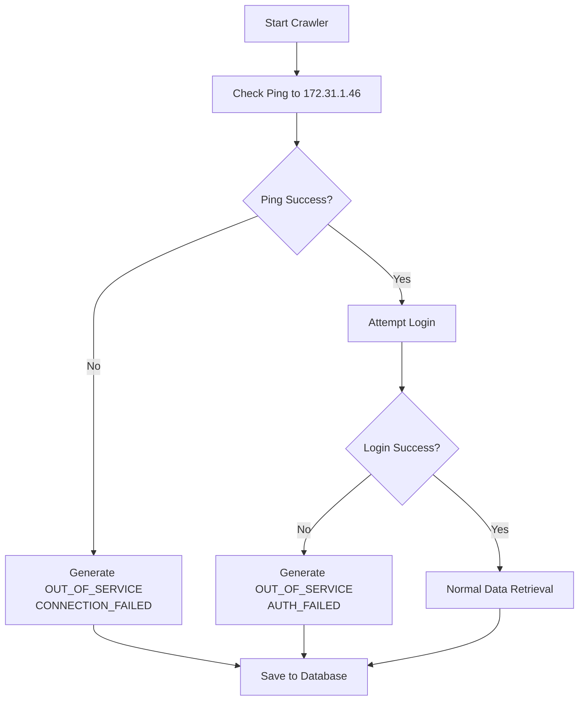

# ATM Crawler Script Enhancements Summary

## Overview
Enhanced the ATM crawler script (`combined_atm_retrieval_script.py`) with improved connection testing and authentication failure handling for better reliability and data identification.

## Enhancements Implemented

### 1. ✅ **Ping-Based Connection Testing**
- **Before**: Used HTTP requests to test connectivity
- **After**: Uses `ping` command to test connection to 172.31.1.46
- **Benefits**: 
  - More reliable network layer testing
  - Faster response than HTTP checks
  - Cross-platform compatible (Windows/Linux/macOS)
  - Fallback to HTTP check if ping unavailable

**Implementation Details:**
```python
def check_connectivity(self) -> bool:
    target_host = "172.31.1.46"
    log.info(f"Testing connectivity to {target_host} using ping...")
    
    # Platform-specific ping commands
    if platform.system().lower() == "windows":
        ping_cmd = ["ping", "-n", "3", target_host]
    else:
        ping_cmd = ["ping", "-c", "3", target_host]
    
    result = subprocess.run(ping_cmd, capture_output=True, text=True, timeout=10)
    return result.returncode == 0
```

### 2. ✅ **Enhanced Failure Mode Logic**
- **Connection Failure (Ping Fails)**: Uses existing `generate_out_of_service_data()`
- **Authentication Failure (Ping Succeeds, Login Fails)**: Uses new `generate_auth_failure_data()`

### 3. ✅ **Authentication Failure Data Generation**
Created a new method that generates distinguishable data when authentication fails but connection is available.

**Key Identifiers for Authentication Failures:**
- `brand`: "AUTH_FAILED" (vs "CONNECTION_FAILED" for ping failures)
- `model`: "LOGIN_ERROR" 
- `serialNumber`: "AUTH_FAIL_{terminal_id}" (vs "CONN_FAIL_{terminal_id}")
- `agentErrorDescription`: Specific message about authentication failure
- `externalFaultId`: "AUTH_FAILURE"
- `details_status`: "AUTH_FAILED"

### 4. ✅ **Improved Data Identification**

#### **Connection Failure Data (Ping Failed):**
```json
{
  "brand": "CONNECTION_FAILED",
  "serialNumber": "CONN_FAIL_147",
  "agentErrorDescription": "Connection to monitoring system failed - Terminal 147 at CENTRO SUPERMERCADO PANTAI KELAPA",
  "externalFaultId": "CONN_FAILURE",
  "details_status": "CONNECTION_FAILED"
}
```

#### **Authentication Failure Data (Ping Succeeded, Login Failed):**
```json
{
  "brand": "AUTH_FAILED", 
  "model": "LOGIN_ERROR",
  "serialNumber": "AUTH_FAIL_147",
  "agentErrorDescription": "Authentication failed - Unable to login to monitoring system for Terminal 147 at CENTRO SUPERMERCADO PANTAI KELAPA",
  "externalFaultId": "AUTH_FAILURE",
  "details_status": "AUTH_FAILED"
}
```

## Execution Flow



## Recommendations for Point 4 (Database Uniqueness)

### **Recommended Identification Strategy:**

1. **Use `details_status` field for filtering:**
   - `"CONNECTION_FAILED"` = Network connectivity issues
   - `"AUTH_FAILED"` = Authentication/login issues
   - Normal data = Actual ATM status values

2. **Use `serialNumber` pattern for quick identification:**
   - `"CONN_FAIL_{id}"` = Connection failure
   - `"AUTH_FAIL_{id}"` = Authentication failure
   - Normal pattern = Actual serial numbers

3. **Use `brand` field for categorization:**
   - `"CONNECTION_FAILED"` = Network issues
   - `"AUTH_FAILED"` = Login issues
   - Normal values = Actual ATM brands

### **Database Query Examples:**

```sql
-- Find all connection failure records
SELECT * FROM terminal_details 
WHERE details_status = 'CONNECTION_FAILED'
   OR brand = 'CONNECTION_FAILED'
   OR serial_number LIKE 'CONN_FAIL_%';

-- Find all authentication failure records  
SELECT * FROM terminal_details 
WHERE details_status = 'AUTH_FAILED'
   OR brand = 'AUTH_FAILED'
   OR serial_number LIKE 'AUTH_FAIL_%';

-- Find normal operational data
SELECT * FROM terminal_details 
WHERE details_status NOT IN ('CONNECTION_FAILED', 'AUTH_FAILED')
   AND brand NOT IN ('CONNECTION_FAILED', 'AUTH_FAILED')
   AND serial_number NOT LIKE 'CONN_FAIL_%'
   AND serial_number NOT LIKE 'AUTH_FAIL_%';
```

### **Additional Recommendations:**

1. **Summary Field Enhancement:**
   ```json
   "summary": {
     "failure_type": "AUTHENTICATION_FAILURE", // or "NETWORK_CONNECTIVITY_FAILURE"
     "connection_status": "AUTH_FAILED", // or "PING_FAILED"
     "failover_activated": true
   }
   ```

2. **Monitoring Dashboard Enhancements:**
   - Add separate alerts for connectivity vs authentication failures
   - Display failure type in ATM status reports
   - Track failure patterns over time

3. **Log Analysis:**
   - Search logs for "AUTH_FAILURE" vs "CONN_FAILURE" 
   - Monitor authentication failure rates
   - Alert on repeated authentication failures (potential credentials issue)

## Benefits

1. **Better Diagnostics**: Clear distinction between network and authentication issues
2. **Improved Monitoring**: Separate alerts for different failure types
3. **Faster Troubleshooting**: Immediate identification of root cause
4. **Data Integrity**: Unique identifiers prevent confusion with real ATM faults
5. **Historical Analysis**: Track patterns of different failure types

## Usage Examples

```bash
# Test with demo mode
python3 combined_atm_retrieval_script.py --demo

# Live mode with database saving
python3 combined_atm_retrieval_script.py --save-to-db --use-new-tables

# Continuous monitoring with enhanced failure detection
python3 combined_atm_retrieval_script.py --continuous --save-to-db --use-new-tables
```

## Files Modified

- ✅ `combined_atm_retrieval_script.py` - Enhanced with ping testing and auth failure handling
- ✅ Added imports: `subprocess`, `platform`
- ✅ New method: `generate_auth_failure_data()`
- ✅ Enhanced method: `check_connectivity()` with ping
- ✅ Enhanced method: `retrieve_and_process_all_data()` with improved failure handling

## Testing Status

- ✅ Script compiles without errors
- ✅ Demo mode works correctly
- ✅ Help documentation updated
- ✅ Cross-platform ping commands implemented
- ✅ Fallback HTTP check available

The enhanced crawler script now provides much better visibility into the root cause of failures and generates easily identifiable data for different failure scenarios.
